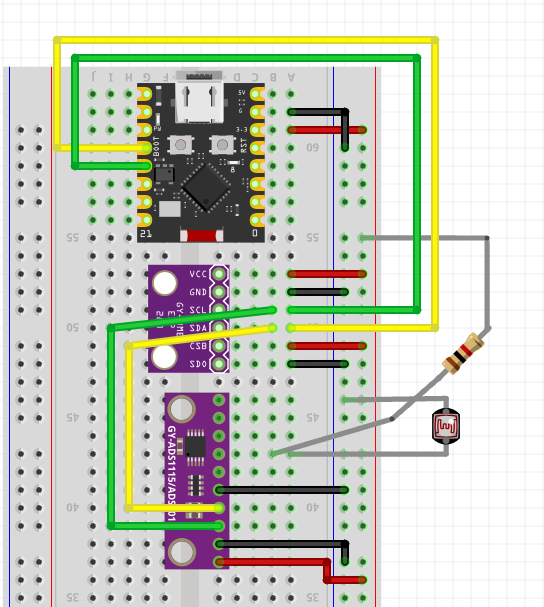
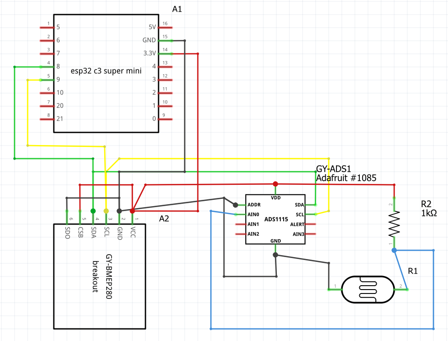

# LDR and 28 humidity sensor
A good approach to calculate the % of humidity is to calculate through interpolation the current value based on "wet and dry" extremes.
Current setup:
- dry: 3.1V
- wet: 1.03V

Applying interpolation:

```math
humidity\% = \frac{V_{dry} - V_{measured}}{V_{dry} - V_{wet}} \times 100
```

With our values:

```math
humidity\% = \frac{3.1 - V_{measured}}{3.1 - 1.03} \times 100 = \frac{3.1 - V_{measured}}{2.07} \times 100
```

Simplified:

```math
humidity\% = 149.76 - 48.31 \times V_{measured}
```

## Wiring

## Schematic
